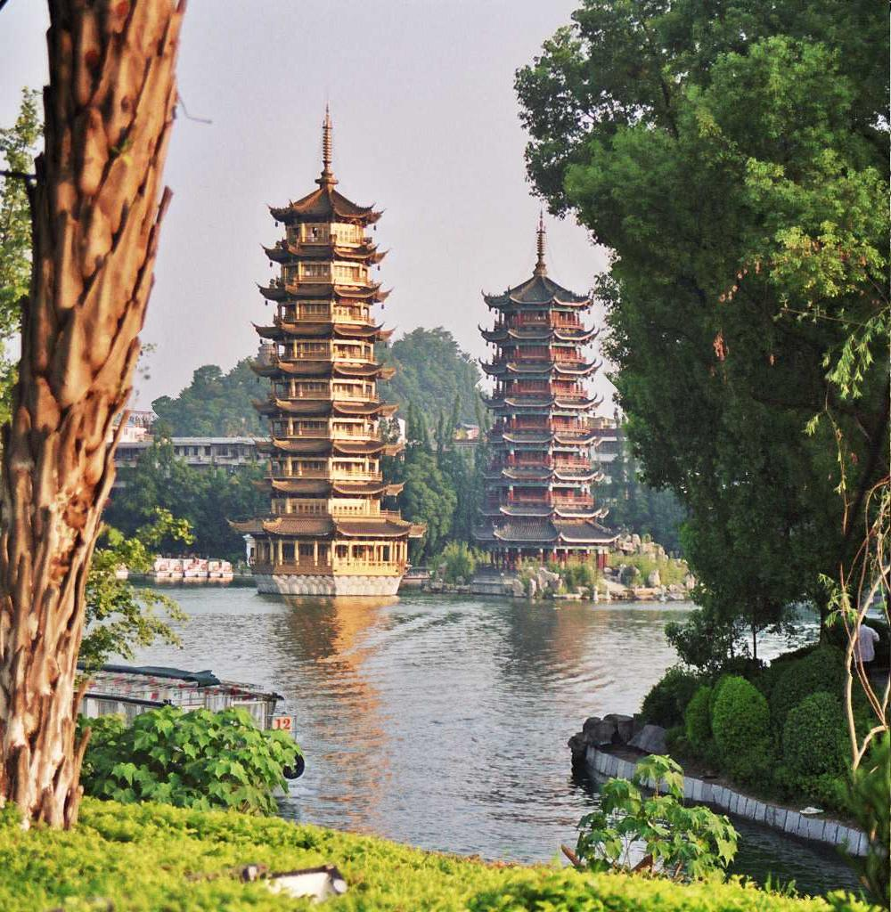
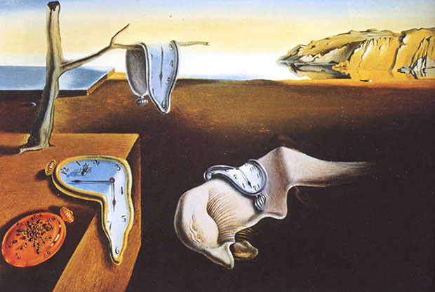
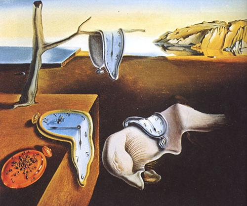

# Seam Carving Parallelism

Seam Carving is a sophisticated technique in image processing that enables content-aware image resizing. It was originally introduced by S. Avidan & A. Shamir in a scientific publication. The technique involves resizing images by selectively removing pixels of lesser importance while keeping the essential ones. This is achieved by identifying and altering "seams" in the image - these are paths of low-energy pixels. The process ensures that the key features of the image remain intact even after resizing.

Project's objective is to reimplement this algorithm in a linear fashion on a CPU, focusing on maximizing computational efficiency utilizing the C programming language. Subsequently, we aim to break down the problem to effectively leverage GPU's parallel processing abilities in conjunction with CPUs' advanced linear processing speed, employing the CUDA extension for C/C++.

## DEMO
Here are the images before and after resizing:

## Using Instructions
For detailed examples on how to run the program, along with explanations, metric evaluations, and conclusions, please refer to the report.ipynb file.